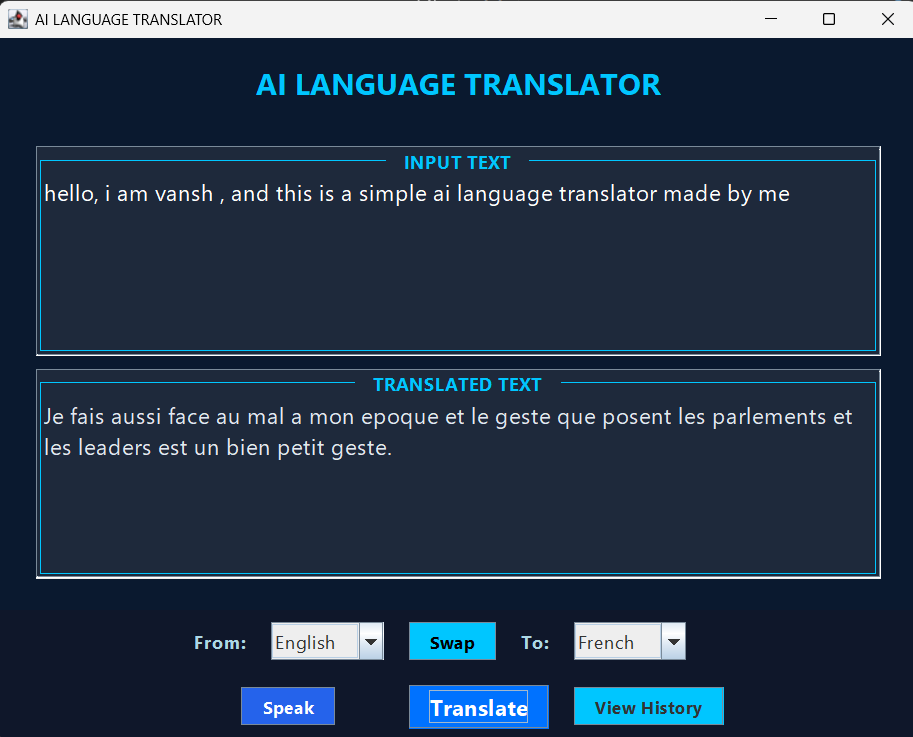

# AI Language Translator (Java Swing + MySQL + Speech API)

A desktop-based multilingual language translator built with **Java Swing** and connected to the **MyMemory Translation API** and **MySQL** database.  
It also integrates **CMU Sphinx Speech Recognition** for optional voice input.

---

## ✨ Features
- Translate text between multiple languages
- Swap source and target languages
- Unicode support (works with Hindi, French, German, etc.)
- View recent translations stored in MySQL
- Speech-to-text input using CMU Sphinx
- Clean, responsive Swing interface

---

## 🧠 Tech Stack
- **Frontend:** Java Swing  
- **Backend:** MySQL (via JDBC)  
- **APIs:** MyMemory Translation API, CMU Sphinx Speech Recognition  
- **Dependencies:**  
  - `mysql-connector-j-9.3.0.jar`  
  - `json-20210307.jar`  
  - `sphinx4-core-5prealpha-SNAPSHOT.jar`  
  - `sphinx4-data-5prealpha-SNAPSHOT.jar`  
  - `sphinx4-samples-5prealpha-SNAPSHOT.jar`

---

## 🧱 Database Setup
```sql
CREATE DATABASE translator_db;
USE translator_db;

CREATE TABLE history (
  id INT AUTO_INCREMENT PRIMARY KEY,
  input_text VARCHAR(500),
  translated_text VARCHAR(500),
  from_lang VARCHAR(50),
  to_lang VARCHAR(50),
  translated_on TIMESTAMP DEFAULT CURRENT_TIMESTAMP
);

## 🖼️ Screenshot


